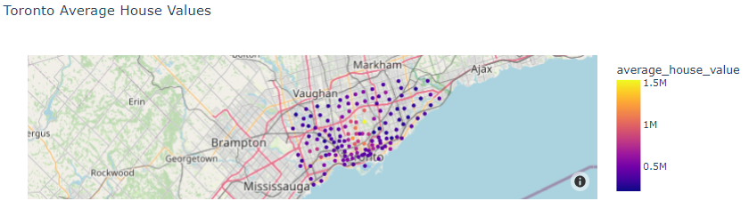

# Unit 6 - Pythonic monopoly

*[Photo by James Wheeler](https://www.pexels.com/@souvenirpixels?utm_content=attributionCopyText&utm_medium=referral&utm_source=pexels) | [Free License](https://www.pexels.com/photo-license/)*

### This repository creates a dashboard to provide charts, maps, and interactive visualizations that help customers explore the data and determine if they want to invest in rental properties in Toronto.

---

## Data used

* [Toronto Open Data](https://open.toronto.ca/)

* [Census Profile, 2016 Census - Toronto Metropolitan Area, Ontario and Canada](https://www12.statcan.gc.ca/census-recensement/2016/dp-pd/prof/details/page.cfm?Lang=E&Geo1=CMACA&Code1=535&Geo2=PR&Code2=01&SearchText=toronto&SearchType=Begins&SearchPR=01&B1=All&TABID=1&type=0)

---

## Buit with

* Python
* Pandas
* Jupyter-lab 
* Mapbox
* Panel
* VS Code

---
